# SPRING BOOT


[TOC]


# 0. 스프링부트란?

- **스프링부트**는 스프링 애플리케이션을 개발하는데 있어 필요한 의존성과 `XML`구성등의 일반적인 공통 시나리오를 자동으로 구성해주고 개발자는 즉시 애플리케이션 로직 개발을 시작할 수 있도록 지원하는 도구이다.

- 스프링부트는 단독실행되는, 실행하기만 하면 되는 상용화 가능한 수준의, 스프링 기반 애플리케이션을 쉽게 만들어낼 수 있다.
- 최소한의 설정으로 스프링 플랫폼과 서드파티 라이브러리들을 사용할 수 있도록 하고 있다.


# 0.1 스프링프레임워크 환경 구성시 요구되는 것들

- 프로젝트에 요구되는 갖가지 의존성과 빌드환경 구성
- `DispatcherServlet`을 선언한 `web.xml` 파일 또는 `WebApplicationInitializer`의 구현
- `MVC`를 사용할 수 있는 환경 구성
- `HTTP`요청에 응답할 컨트롤러 클래스
- 애플리케이션을 배포할 웹 애플리케이션 서버

  반복되고 복잡한 **스프링프레임워크**의 환경구성 작업으로부터 벗어날 수 있는 방법은 없을까? `"누가 대신 해줬으면 좋겠다."`


# 0.2 스프링부트 특징

- 모든 스프링 개발환경에 빠르게 접근

-  요구사항을 빠르게 처리할 수 있는 기본 설정값

-  프로젝트 환경 구축에서 요구되는 기능 외적인 것들을 제공(내장형 웹서버, 시큐리티, 측정, 외부설정 등)

-  시작하기 위해 XML 기반 설정이나 코드를 요구하지 않음

  


# 1. 스프링부트 시작하기

## 1.1. 스프링부트 프로젝트 생성

- 주의사항

  - **네트워크**가 연결되어 있어야 한다.

  - **Maven** 혹은 **Gradle** 플러그인이 IDE에 설치되어 있어야 한다.

## 1.2. <http://start.spring.io/> 에서 생성하기

### 1.2.1. 프로젝트 메타데이터를 등록

- Maven 보다는 Gradle
  - Maven 예제가 많은 편이지만, Maven의 골, 페이즈만으로는 프로젝트의 필요한 기능을 모두 지원하지 못할 수도 있음
  - Gradle은 Groovy DSL로 구성되어 있어서 그루비를 익혀야하지만, 지원되는 기능을 익히고 나면 훨씬 강력해짐
- 배포형태에 따라서 war 또는 jar
  - 기본적으로는 단독실행가능지만, 프로젝트 환경에 따라 배포할 수도 있으니 war도 가능

### 1.2.2. [Generate Project] 버튼클릭

- 'artifact' 이름으로 된 zip 파일 다운로드

### 1.2.3. IDE에서 Import Project

- Maven 혹은 Gradle 플러그인 설치 되어 있어야 함

## 1.3. STS에서 생성하기

### 1.3.1. `[File]-[New]-[Spring Starter project]` 선택

### 1.3.2. 사용하려는 스프링 starter 선택

- 최초에는 필요한 라이브러리들을 다운로드 받는데 상단한 시간이 소요된다.

## 1.4. 스프링부트 프로젝트 실행

- `[Run as]` - `[Spring Boot App]` 선택

- ```
  [gradle] - [Tasks quick launcher]
  ```

   

  을 이용해서 실행

  - 프로젝트 지정된 JDK 버전과 IDE 실행 JDK 버전이 다르면...

- 프로젝트 생성 위치에서 `$ gradle bootRun` 명령 실행

------

# 2. 스프링부트 구성 살펴보기

## 2.1. 최초 생성된 스프링부트 프로젝트 살펴보기

### 2.1.1. jar 프로젝트

- `build.gradle`

```
//코드 생략
apply plugin: 'java'
apply plugin: 'eclipse'
apply plugin: 'idea'
apply plugin: 'spring-boot'
apply plugin: 'io.spring.dependency-management'

jar {
    baseName = 'demo'
    version = '0.0.1-SNAPSHOT'
}
//코드생략
dependencies {
    compile("org.springframework.boot:spring-boot-starter-web")
    testCompile("org.springframework.boot:spring-boot-starter-test")
}
```

- `{artifact-name}Application.java`
- IDE에서 Java Application project로 인식
- `build` 태스크 실행시 `demo.jar` 생성
- 실행

```
$ java -jar demo.jar
```

### 2.1.2. war 프로젝트

- `build.gradle`

```
//코드생략
apply plugin: 'java'
apply plugin: 'eclipse-wtp'
apply plugin: 'idea'
apply plugin: 'spring-boot'
apply plugin: 'io.spring.dependency-management'
apply plugin: 'war'

war {
    baseName = 'demowar'
    version = '0.0.1-SNAPSHOT'
}
//코드생략
configurations {
    providedRuntime
}

dependencies {
    compile("org.springframework.boot:spring-boot-starter-web")
    providedRuntime("org.springframework.boot:spring-boot-starter-tomcat")
    testCompile("org.springframework.boot:spring-boot-starter-test")
}
```

- `public class ServletInitializer extends SpringBootServletInitializer` 클래스가 있음
- IDE에서 웹프로젝트로 인식
- `build` 태스크 실행시 `demowar.war` 생성
- 실행
  - <https://spring.io/guides/gs/convert-jar-to-war/>

```
$ java -jar demowar.war
```


# 3. STS 스프링부트 실습

### 3.1 스프링 프로젝트 핸즈온

### 3.1.1 Spring Starter Project 선택

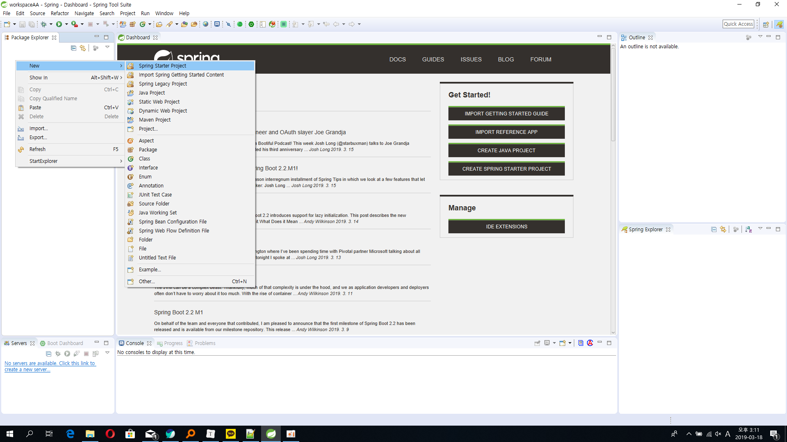


### 3.1.2 New Spring Starter Project 선택

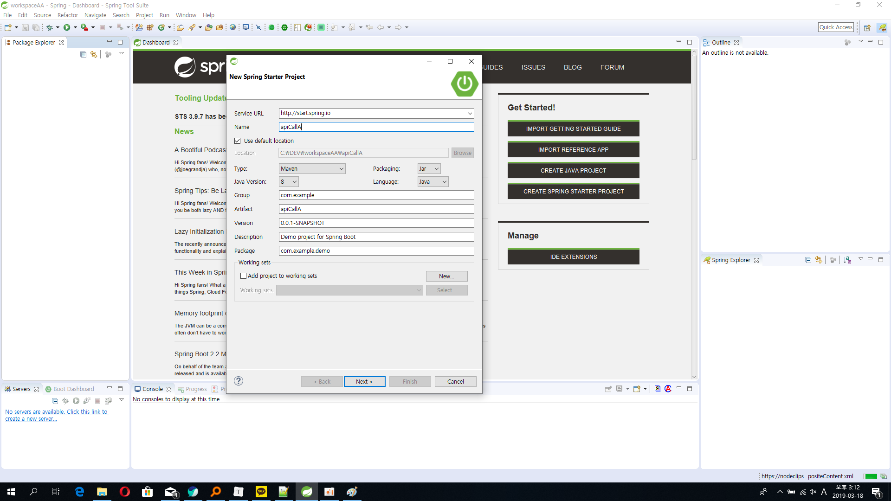

### 3.1.3 Available 설정

​     - web 검색 후 체크 -> next


### 3.1.4 Base Url / Full Url 

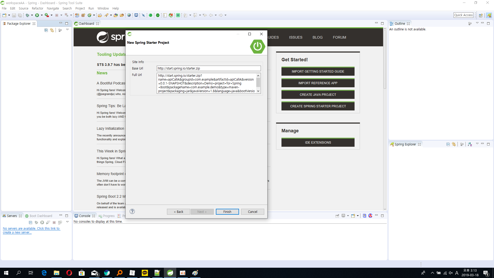

### 3.1.5 프로젝트 생성중

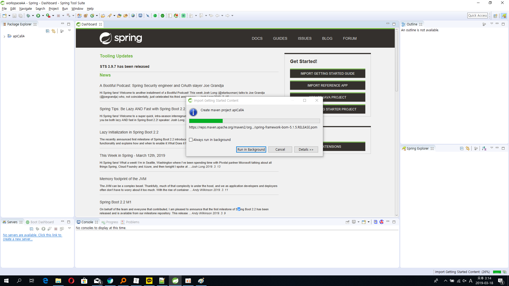

### 3.1.6 test용 Class 생성

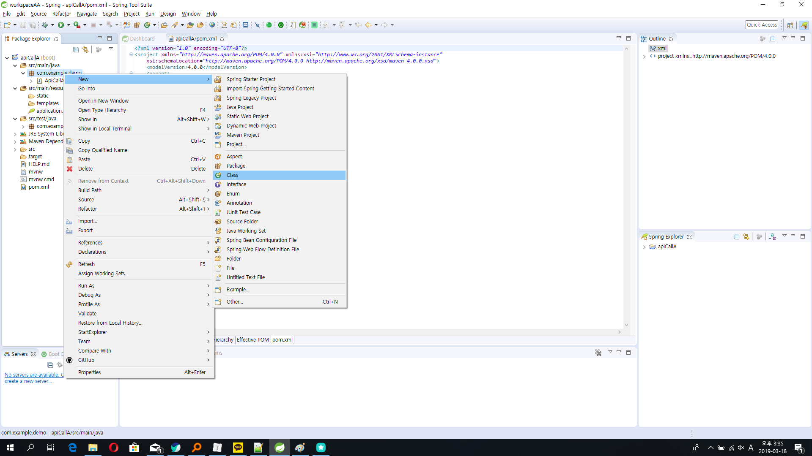

### 3.1.7 Class 정보 확인

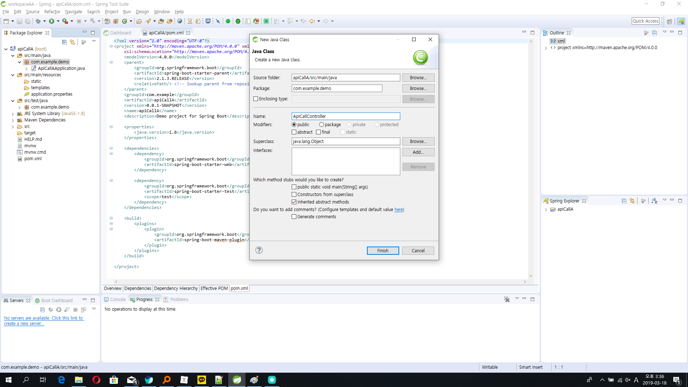

### 3.1.8 Class 내용 작성

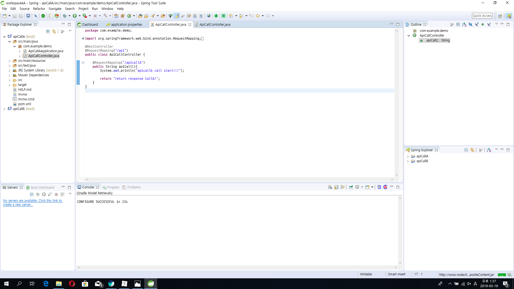

### 3.1.9 서버포트 설정 

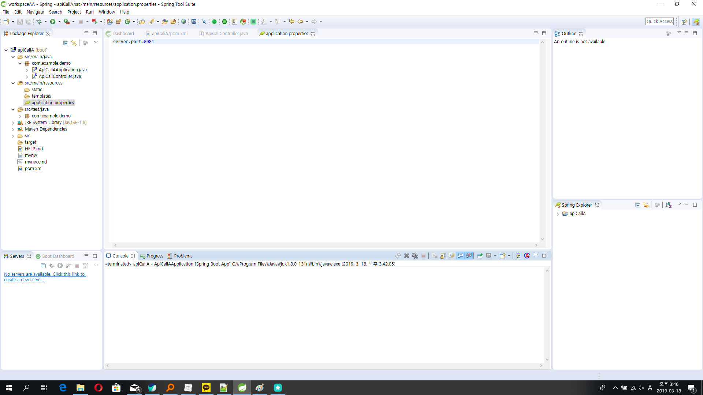

### 3.1.10 스프링부트 기동

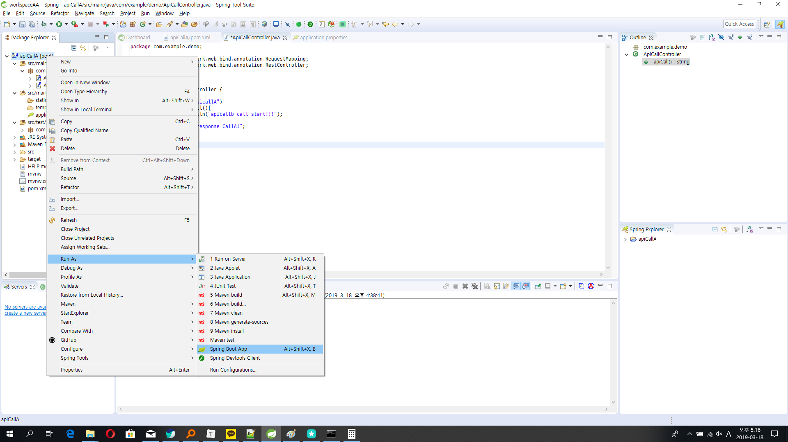

### 3.1.11 스프링부트 실행 확인

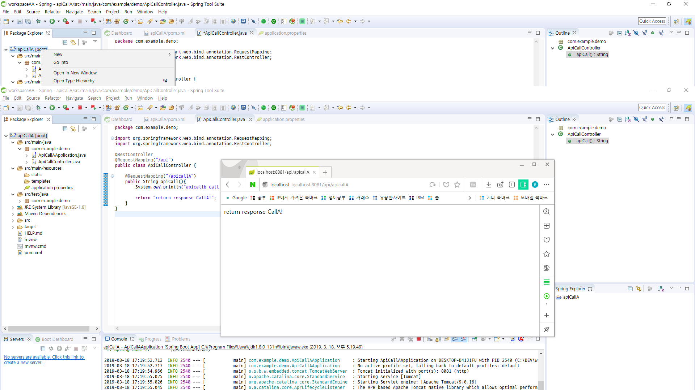

### 3.2 프로젝트 jar 만들기

### 3.2.1 maven build...

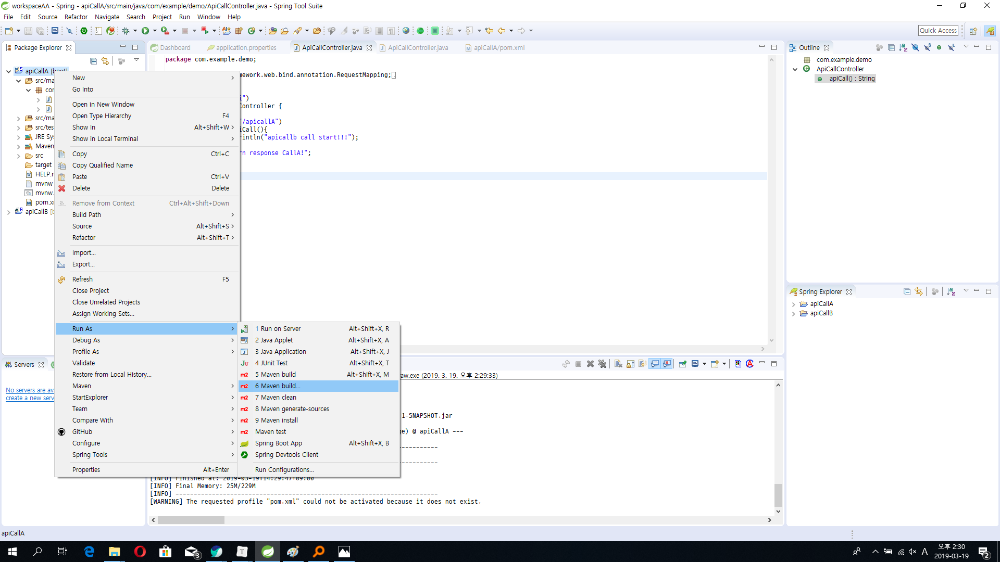

### 3.2.2 package 설정

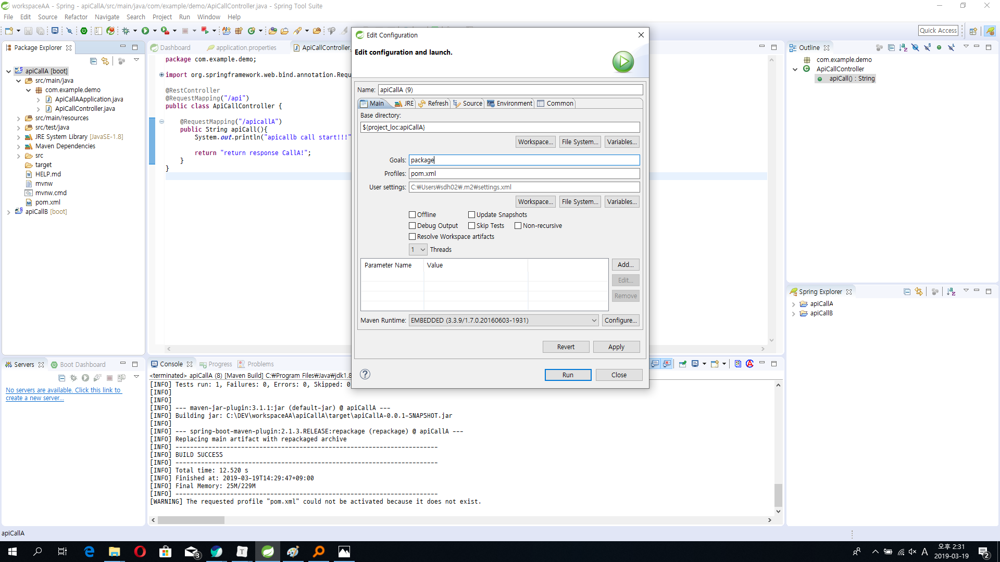

3.2.3 jar 파일 확인

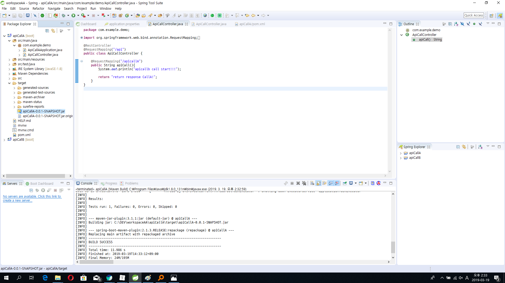

### 3.2.3 cmd실행 

   - 해당 jar 경로로 이동
   - java -jar apiCallA-0.0.1-SNAPSHOT.jar 실행

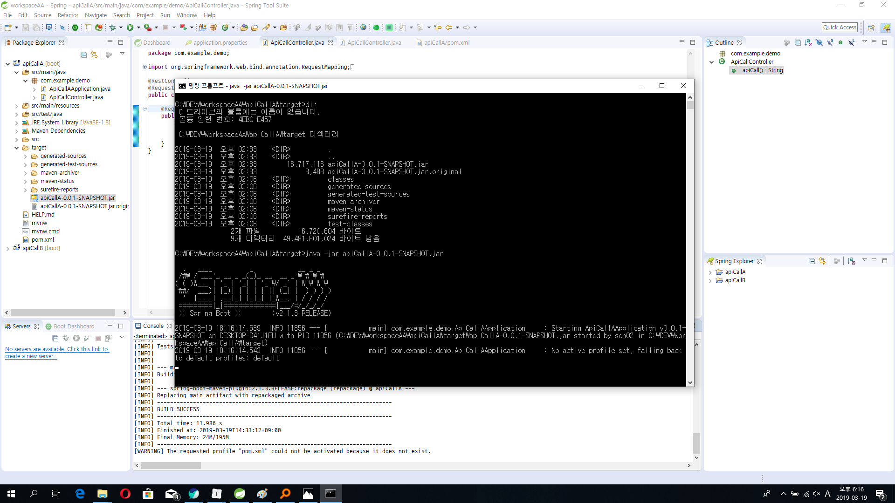

### 3.2.4 확인

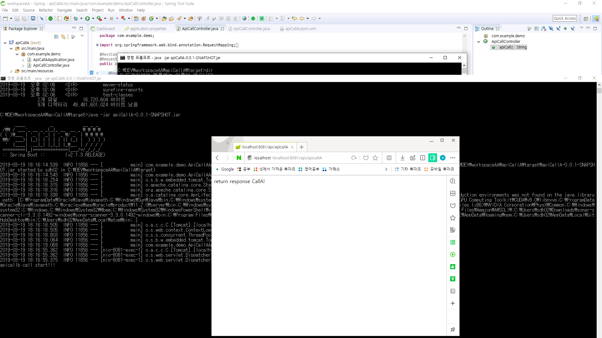

출처

https://gist.github.com/ihoneymon/8a905e1dd8393b6b9298

https://eglowc.tistory.com/37