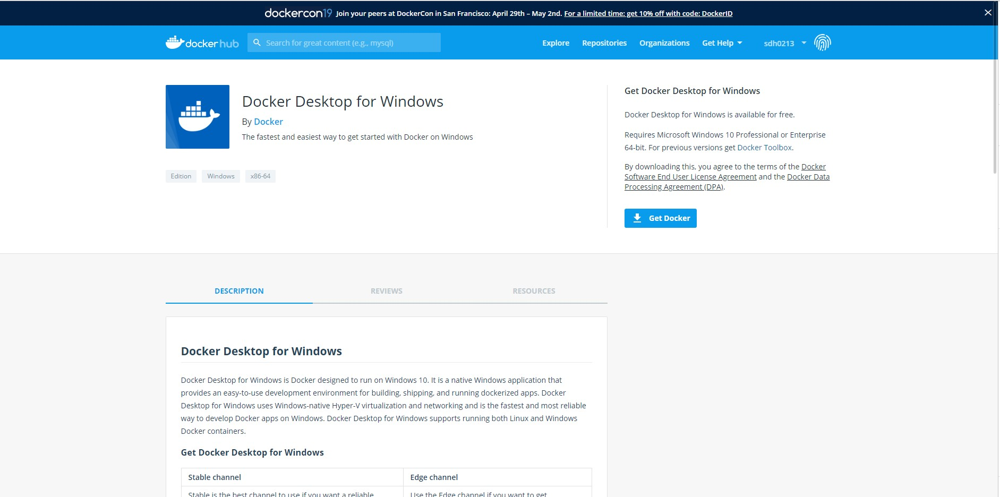
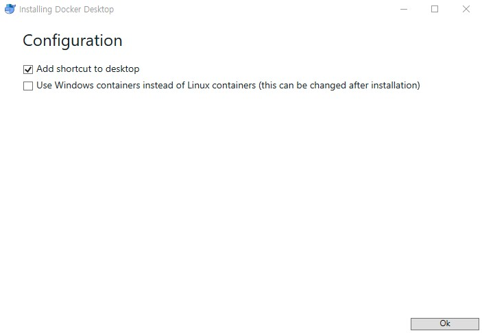
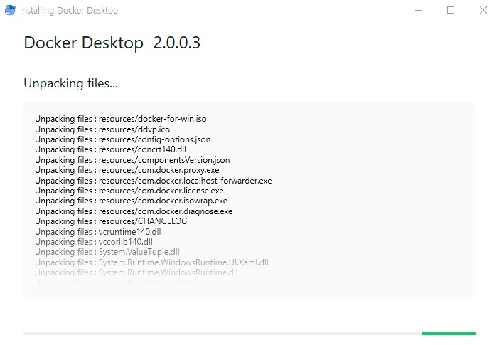
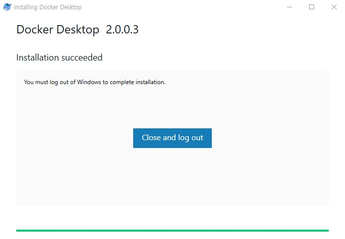
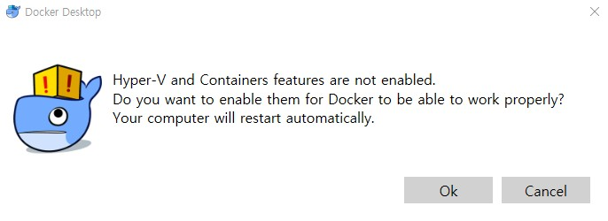
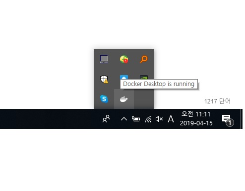
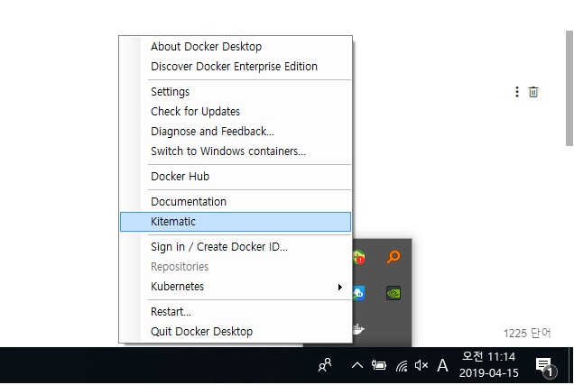
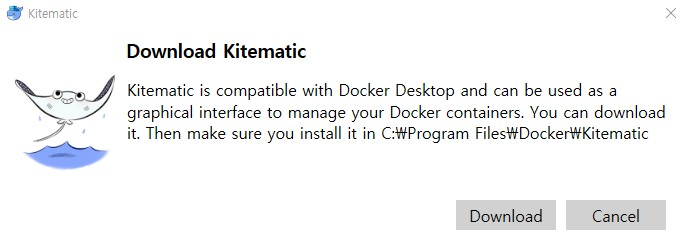
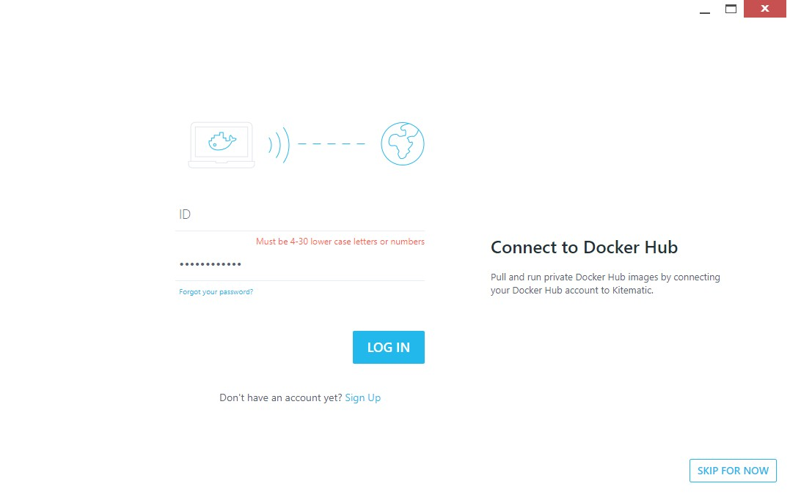
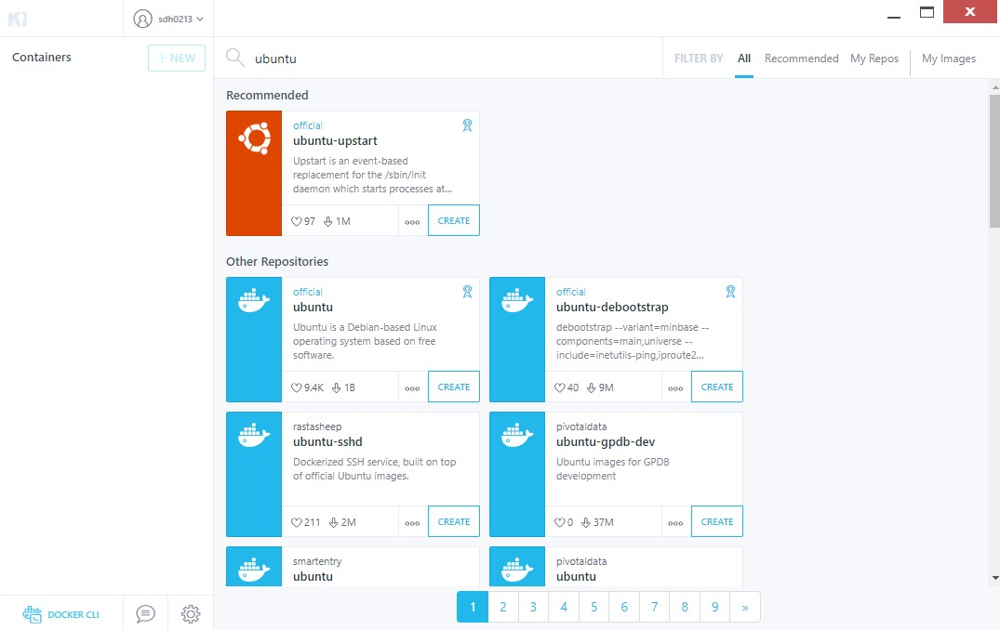

# DOCKER


[TOC]


# 0. DOCKER란?

- 도커는 **컨테이너 기반의 오픈소스 가상화 플랫폼**입니다.

  컨테이너라 하면 배에 실는 네모난 화물 수송용 박스를 생각할 수 있는데 각각의 컨테이너 안에는 옷, 신발, 전자제품, 술, 과일등 다양한 화물을 넣을 수 있고 규격화되어 컨테이너선이나 트레일러등 다양한 운송수단으로 쉽게 옮길 수 있습니다.

  서버에서 이야기하는 컨테이너도 이와 비슷한데 다양한 프로그램, 실행환경을 컨테이너로 추상화하고 동일한 인터페이스를 제공하여 프로그램의 배포 및 관리를 단순하게 해줍니다. 백엔드 프로그램, 데이터베이스 서버, 메시지 큐등 어떤 프로그램도 컨테이너로 추상화할 수 있고 조립PC, AWS, Azure, Google cloud등 어디에서든 실행할 수 있습니다.

  컨테이너를 가장 잘 사용하고 있는 기업은 구글인데 [2014년 발표](https://speakerdeck.com/jbeda/containers-at-scale) 에 따르면 구글은 모든 서비스들이 컨테이너로 동작하고 매주 20억 개의 컨테이너를 구동 한다고 합니다.

- 컨테이너(containar)

  컨테이너는 격리된 공간에서 프로세스가 동작하는 기술입니다. 가상화 기술의 하나지만 기존방식과는 차이가 있습니다.

  기존의 가상화 방식은 주로 **OS를 가상화**하였습니다.

  우리에게 익숙한 [VMware](http://www.vmware.com/)나 [VirtualBox](https://www.virtualbox.org/)같은 가상머신은 호스트 OS위에 게스트 OS 전체를 가상화하여 사용하는 방식입니다. 이 방식은 여러가지 OS를 가상화(리눅스에서 윈도우를 돌린다던가) 할 수 있고 비교적 사용법이 간단하지만 무겁고 느려서 운영환경에선 사용할 수 없었습니다.

  이러한 상황을 개선하기 위해 CPU의 가상화 기술([HVM](https://en.wikipedia.org/wiki/Hardware-assisted_virtualization))을 이용한 [KVM](http://www.linux-kvm.org/)Kernel-based Virtual Machine과 [반가상화](https://en.wikipedia.org/wiki/Paravirtualization) Paravirtualization방식의 [Xen](https://www.xenproject.org/)이 등장합니다. 이러한 방식은 게스트 OS가 필요하긴 하지만 전체OS를 가상화하는 방식이 아니였기 때문에 호스트형 가상화 방식에 비해 성능이 향상되었습니다. 이러한 기술들은 [OpenStack](https://www.openstack.org/)이나 AWS, [Rackspace](https://www.rackspace.com/)같은 클라우드 서비스에서 가상 컴퓨팅 기술의 기반이 되었습니다.


# 1. 이미지란?

- 이미지는 **컨테이너 실행에 필요한 파일과 설정값등을 포함하고 있는 것**으로 상태값을 가지지 않고 변하지 않습니다(Immutable). 컨테이너는 이미지를 실행한 상태라고 볼 수 있고 추가되거나 변하는 값은 컨테이너에 저장됩니다. 같은 이미지에서 여러개의 컨테이너를 생성할 수 있고 컨테이너의 상태가 바뀌거나 컨테이너가 삭제되더라도 이미지는 변하지 않고 그대로 남아있습니다.

  ubuntu이미지는 ubuntu를 실행하기 위한 모든 파일을 가지고 있고 MySQL이미지는 debian을 기반으로 MySQL을 실행하는데 필요한 파일과 실행 명령어, 포트 정보등을 가지고 있습니다. 좀 더 복잡한 예로 Gitlab 이미지는 centos를 기반으로 ruby, go, database, redis, gitlab source, nginx등을 가지고 있습니다.

  말그대로 이미지는 컨테이너를 실행하기 위한 모든 정보를 가지고 있기 때문에 더 이상 의존성 파일을 컴파일하고 이것저것 설치할 필요가 없습니다. 이제 새로운 서버가 추가되면 미리 만들어 놓은 이미지를 다운받고 컨테이너를 생성만 하면 됩니다. 한 서버에 여러개의 컨테이너를 실행할 수 있고, 수십, 수백, 수천대의 서버도 문제없습니다.

  도커 이미지는 [Docker hub](https://hub.docker.com/)에 등록하거나 [Docker Registry](https://docs.docker.com/registry/) 저장소를 직접 만들어 관리할 수 있습니다. 현재 공개된 도커 이미지는 50만개가 넘고 Docker hub의 이미지 다운로드 수는 80억회에 이릅니다. 누구나 쉽게 이미지를 만들고 배포할 수 있습니다.

- Dockerfile

  ```
  FROM node:10.15.1
  EXPOSE 8080
  COPY server.js .
  CMD node server.js
  ```

  도커는 이미지를 만들기 위해 `Dockerfile`이라는 파일에 자체 DSLDomain-specific language언어를 이용하여 이미지 생성 과정을 적습니다. 


# 2. Docker 설치하기

### 1) linux	

- 설치 스크립트를 이용하여 설치 

```
$ curl -fsSL https://get.docker.com/ | sudo sh

[sudo] password for ubuntu:                                                     
apparmor is enabled in the kernel and apparmor utils were already installed     
+ sh -c apt-key adv --keyserver hkp://ha.pool.sks-keyservers.net:80 --recv-keys 
58118E89F3A912897C070ADBF76221572C52609D                                        
Executing: /tmp/tmp.gbqgevAxMh/gpg.1.sh --keyserver                             
hkp://ha.pool.sks-keyservers.net:80                                             
--recv-keys                                                                     
58118E89F3A912897C070ADBF76221572C52609D                                        
gpg: requesting key 2C52609D from hkp server ha.pool.sks-keyservers.net         
gpg: key 2C52609D: public key "Docker Release Tool (releasedocker) <docker@docke
r.com>" imported                                                                
gpg: Total number processed: 1                                                  
gpg:               imported: 1  (RSA: 1)                                        
+ break                                                                         
+ sh -c apt-key adv -k 58118E89F3A912897C070ADBF76221572C52609D >/dev/null      
+ sh -c mkdir -p /etc/apt/sources.list.d                                        
+ dpkg --print-architecture                                                     
+ sh -c echo deb \[arch=amd64\] https://apt.dockerproject.org/repo ubuntu-xenial
 main > /etc/apt/sources.list.d/docker.list                                     
+ sh -c sleep 3; apt-get update; apt-get install -y -q docker-engine
.....

$ sudo docker version

Client:
 Version:           18.06.1-ce
 API version:       1.38
 Go version:        go1.10.4
 Git commit:        e68fc7a
 Built:             Fri Jan 25 14:33:54 2019
 OS/Arch:           linux/amd64
 Experimental:      false

Server:
 Engine:
  Version:          18.06.1-ce
  API version:      1.38 (minimum version 1.12)
  Go version:       go1.10.4
  Git commit:       e68fc7a
  Built:            Thu Jan 24 10:56:33 2019
  OS/Arch:          linux/amd64
  Experimental:     false

```

- sudo 없이 사용하기 

  docker는 기본적으로 root권한이 필요합니다. root가 아닌 사용자가 sudo없이 사용하려면 해당 사용자를 `docker`그룹에 추가합니다.

```
$ sudo usermod -aG docker $USER # 현재 접속중인 사용자에게 권한주기
$ sudo usermod -aG docker your-user # your-user 사용자에게 권한주기

```

### 2) windows

- 윈도우 버전 Docker 다운로드 (사이트 가입 및 다운)

  <https://hub.docker.com/editions/community/docker-ce-desktop-windows>

  Get Docker 클릭하여 다운로드.

  

- 다운로드 받은 installer 더블클릭해서 설치 시작 

  Docker for Windows Installer.exe 실행

- 설치 진행 ok 클릭

  

- Docker 설치 진행중

  


- Close and log out 후 가상화 관련 메시지 확인

  

- OK 버튼 클릭하여 재부팅 

  

- 재부팅후 도커 Starting 이미지 확인

  

- kitematic 설치 

  도커 이미지 오른쪽 버튼 클릭하여 kiitematic 클릭

  


- kitematic 다운로드 

  


- 다운로드 받은 파일 압축 해제후 Kitematic 클릭

  도커 로그인 

  

- 도커 이미지 확인 Cli 사용 

  왼쪽 맨 아래 Docker Cli 클릭

  


# 3. 컨테이너 실행하기 

- 도커 실행 명령어 

```
$ docker run [OPTIONS] IMAGE[:TAG|@DIGEST] [COMMAND] [ARG...]
```

- 자주 사용하는 옵션

| 옵션  | 설명                                                   |
| ----- | ------------------------------------------------------ |
| -d    | detached mode 흔히 말하는 백그라운드 모드              |
| -p    | 호스트와 컨테이너의 포트를 연결 (포워딩)               |
| -v    | 호스트와 컨테이너의 디렉토리를 연결 (마운트)           |
| -e    | 컨테이너 내에서 사용할 환경변수 설정                   |
| –name | 컨테이너 이름 설정                                     |
| –rm   | 프로세스 종료시 컨테이너 자동 제거                     |
| -it   | -i와 -t를 동시에 사용한 것으로 터미널 입력을 위한 옵션 |
| –link | 컨테이너 연결 [컨테이너명:별칭]                        |

- nginx 이미지 pull 및 실행

```
$ docker image pull nginx

Using default tag: latest
latest: Pulling from library/nginx
6ae821421a7d: Pull complete 
da4474e5966c: Pull complete 
eb2aec2b9c9f: Pull complete 
Digest: sha256:dd2d0ac3fff2f007d99e033b64854be0941e19a2ad51f174d9240dda20d9f534
Status: Downloaded newer image for nginx:latest

$ docker run -p 8080:80 nginx

172.17.0.1 - - [18/Feb/2019:05:09:08 +0000] "GET / HTTP/1.1" 200 612 "-" "Mozilla/5.0 (X11; Ubuntu; Linux x86_64; rv:65.0) Gecko/20100101 Firefox/65.0" "-"
2019/02/18 05:09:09 [error] 7#7: *1 open() "/usr/share/nginx/html/favicon.ico" failed (2: No such file or directory), client: 172.17.0.1, server: localhost, request: "GET /favicon.ico HTTP/1.1", host: "localhost:8080"
172.17.0.1 - - [18/Feb/2019:05:09:09 +0000] "GET /favicon.ico HTTP/1.1" 404 153 "-" "Mozilla/5.0 (X11; Ubuntu; Linux x86_64; rv:65.0) Gecko/20100101 Firefox/65.0" "-"

```

- 브라우저 접속

  브라우저에 localhost:8080 실행 

  nginx 기동 확인 


# 4. Docker 기본 명령어 

- 컨테이너 목록 확인하기 

```
								docker ps [OPTIONS]
```

```
$ docker ps -a 

CONTAINER ID        IMAGE               COMMAND                  CREATED             STATUS                          PORTS                    NAMES
872c0c964980        nginx               "nginx -g 'daemon of…"   8 minutes ago       Exited (0) About a minute ago                            priceless_goldwasser
06dcaba74d9f        registry            "/entrypoint.sh /etc…"   5 weeks ago         Exited (255) 4 weeks ago        0.0.0.0:5000->5000/tcp   docker-registry
```

- 컨테이너 중지하기 

```
					docker stop [OPTIONS] CONTAINER [CONTAINER...]
```

```
$ docker ps # get container ID
$ docker stop ${TENSORFLOW_CONTAINER_ID}
$ docker ps -a # show all containers
```

- 이미지 목록 확인하기  

```
				    docker images [OPTIONS] [REPOSITORY[:TAG]]
```

```
$ docker images

REPOSITORY                  TAG                 IMAGE ID            CREATED             SIZE
wordpress                   latest              b1fe82b15de9        43 hours ago        400.2 MB
redis                       latest              45c3ea2cecac        44 hours ago        182.9 MB
mysql                       5.7                 f3694c67abdb        46 hours ago        400.1 MB
ubuntu                      16.04               104bec311bcd        4 weeks ago         129 MB
teamlab/pydata-tensorflow   0.1                 7bdf5d7e0191        6 months ago        3.081 GB

```

- 이미지 다운로드하기(pull)

```
				    docker pull [OPTIONS] NAME[:TAG|@DIGEST]
```

```
$ docker pull ubuntu:14.04

14.04: Pulling from library/ubuntu
e53f134edff2: Pull complete 
efbbd466a715: Pull complete 
e11368b8e0c7: Pull complete 
7dab2de7692b: Pull complete 
Digest: sha256:cac55e5d97fad634d954d00a5c2a56d80576a08dcc01036011f26b88263f1578
Status: Downloaded newer image for ubuntu:14.04

```

- 이미지 삭제하기(RMI)

```
				    docker rmi [OPTIONS] IMAGE [IMAGE...]
```

```
$ docker images # get image ID
$ docker rmi ${TENSORFLOW_IMAGE_ID}
```

- 컨테이너 로그보기

```
				    docker logs [OPTIONS] CONTAINER
```

```
$ docker ps
$ docker logs ${WORDPRESS_CONTAINER_ID}

# -f 옵션
$ docker logs -f ${WORDPRESS_CONTAINER_ID}

# -tail 옵션
$ docker logs --tail 10 ${WORDPRESS_CONTAINER_ID}
```

- 컨테이너 실행하기(실행중인 컨테이너 안에 들어가기)

```
				   docker exec [OPTIONS] CONTAINER COMMAND [ARG...]
```

```
$ docker exec -it 1cc000e8f6eb bash
```

# 5. Docker 이미지 생성 및 실행   

- SpringBoot 시간에 만든 jar 파일 준비

  . XXXXX _XXXX.jar 

- jar파일이 있는 폴더에 Dockerfile 파일을 만든다.( notepad 등 편집기 사용하여 생성하세요~)

  . 파일명 Dockerfile

  . 내용 

  ```

  FROM openjdk:8-jdk-alpine
  VOLUME /tmp
  ADD xxxxx_xxxxx.jar app.jar     ( 자신이 만든 jar 명으로 변경)
  ENV JAVA_OPTS=""
  ENTRYPOINT ["java","-Djava.security.egd=file:/dev/./urandom","-jar","/app.jar"]
  EXPOSE 8090
  
  ```

- 도커 이미지 생성

  docker build -t xxx .      ( xxx 다음에 점(.) 확인)

- 도커 실행 

  docker run -p 8080:8090 xxx