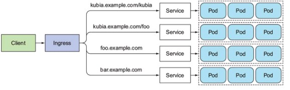
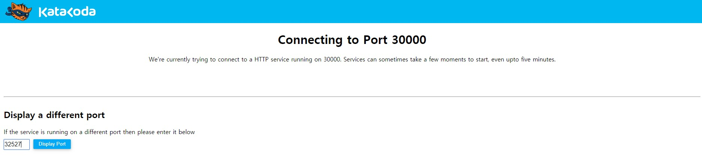

# kubernates


[TOC]


# 0. kubernates란?

- 쿠버네티스는 컨테이너 오케스트레이션 플랫폼 중 하나로, 구글이 자사 서비스를 위해 개발했던 Borg에서 얻은 운영 노하우를 오픈소스로 공개한 것 입니다.

  K8S == kubernetes

- http://kubernetes.io

- 확장성을 고려한 설계

      - 스케줄링, 스토리지, 네트워킹을 위한 플러그인을 제공하는 풍부한 에코 시스템
      - 여러 컨테이너에 걸처 클라이언트 요청을 분산. 

- 리눅스 재단에 의해 관리되는 오픈 소스 프로젝트

  - 구글의 경험과 내부시스템에 의해 영감받고 영향받음


# 1. 쿠버네티스 개념

- Pod 

  - 배치의 단위를 나타냄. 

  - Pod내의 컨테이너들은 함께 배포 , 시작, 중단, 그리고 그룹으로 복제됨. 

  - Pod내의 컨테이너들은 같은 스토리지 볼륨, 네트워크 인터페이스를 공유함.

  - pod당 1개 컨테이너 모델이 가장 일반적인 use case임. 

    

- Service 

  - Pods의 하나의 논리적 세트와 접근정책을 정의하는 추상화
  - 1개의 endpoint로 노출 되는 1개 이상  pods의 모음
  - service는 1개의 고정IP 주소를 가지고(라벨에 의해 선택된) pods의 세트를 참조할 방법을 제공함. 
  
  
  


# 2. Docker 이미지 만들기

개발 환경이 다 달라서 실제 웹에서 실습할수 있는 katacoda라는 사이트에서 실습 하도록 

하겠습니다. 

url : <https://www.katacoda.com/courses/kubernetes/launch-single-node-cluster>


### 1) 이미지생성

- 본인의 home 또는 temp 디렉토리에 server.js 및 Dockerfile 생성

```
$ vi server.js

var http = require('http');

var handleRequest = function(request, response) {
  console.log('Received request for URL: ' + request.url);
  response.writeHead(200);
  response.end('Hello World!');
};
var www = http.createServer(handleRequest);
www.listen(8080);

:wq!

```

- Dockerfile 생성

```
$ vi Dockerfile

FROM node:6.14.2
EXPOSE 8080
COPY server.js .
CMD node server.js

:wq!

```

- docker build 

  sdhXXXX/test:0.1     < ---------- sdhXXXX 은 본인의 도커 username , test는 application 이미지명, 0.1은 tag명 

  이구조로 build를 해야 도커 허브에 push 할수 있음. 

```
$ docker build -t sdhXXX/test:0.1 .
Sending build context to Docker daemon   29.7kB
Step 1/4 : FROM node:6.14.2
 ---> 00165cd5d0c0
Step 2/4 : EXPOSE 8080
 ---> Using cache
 ---> edc6935ce0a5
Step 3/4 : COPY server.js .
 ---> Using cache
 ---> 43443ee6a23f
Step 4/4 : CMD node server.js
 ---> Using cache
 ---> bf6bb4c7e82e
Successfully built bf6bb4c7e82e
Successfully tagged sdhXXXX/test:0.1
```

- docker login

```
$ docker login
Login with your Docker ID to push and pull images from Docker Hub. If you don't have a Docker ID, head over to https://hub.docker.com to create one.
Username: sdhXXXX
Password:
Login Succeeded

```

- docker push 

```
$ docker push sdhxxxx/test:0.1
The push refers to a repository [docker.io/sdhxxxx/test]
ff828b243849: Pushed
aeaa1edefd60: Pushed
6e650662f0e3: Pushed
8c825a971eaf: Pushed
bf769027dbbd: Pushed
f3693db46abb: Pushed
bb6d734b467e: Pushed
5f349fdc9028: Pushed
2c833f307fd8: Pushed
0.1: digest: sha256:3d8d7a8c3f981d600d5c1c079ea18aa50b2b1f0c8fcdd44113e77ca6e6769f1a size: 2214

```

# 2. K8S 배포  

- k8s 배포 및 확인 

```
$ kubectl create deployment test --image=sdhxxxx/test:0.1
deployment.apps/test created

$ kubectl get deployment
NAME   READY   UP-TO-DATE   AVAILABLE   AGE
test   1/1     1            1           6s

$ kubectl get pod
NAME                   READY   STATUS    RESTARTS   AGE
test-f8d7b864d-85jzv   1/1     Running   0          13s

```

- k8s service expose

```
$ kubectl expose deployment test --type=LoadBalancer --port=8080
service/test exposed

$ kubectl get services
NAME         TYPE           CLUSTER-IP       EXTERNAL-IP   PORT(S)          AGE
kubernetes   ClusterIP      10.96.0.1        <none>        443/TCP          41m
test         LoadBalancer   10.105.109.104   <pending>     8080:32527/TCP   7s

```

- Dashboard 텝에서 포트 32527(본인의 포트)를 넣고 확인 

  